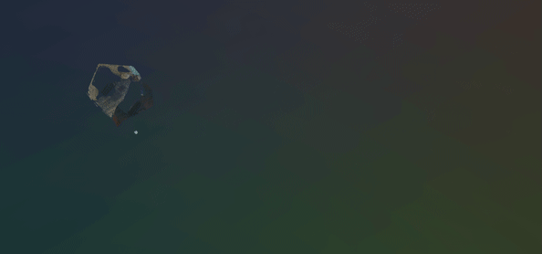
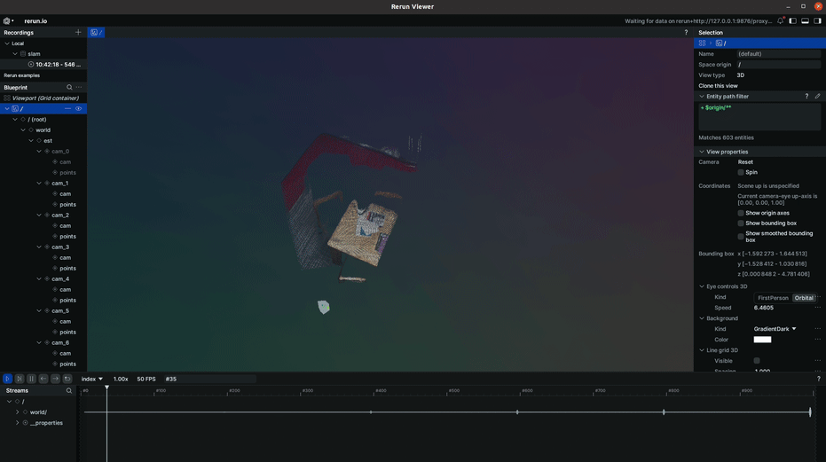
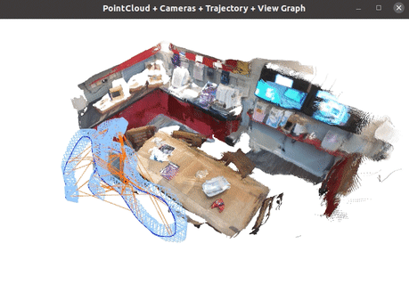

<!-- PROJECT LOGO -->
<h1 align="center" style="display: flex; align-items: center; justify-content: center; flex-wrap: wrap;">
  
  ViSTA-SLAM: Visual SLAM with Symmetric Two-view Association
</h1>


  <p align="center">
    <a href="https://ganlinzhang.xyz" target="_blank"><strong>Ganlin Zhang<sup>1,2</sup></strong></a>
    ·
    <a href="https://shenhanqian.github.io/" target="_blank"><strong>Shenhan Qian<sup>1,2</sup></strong></a>
    ·
    <a href="https://xiwang1212.github.io/homepage/" target="_blank"><strong>Xi Wang<sup>1,2,3</sup></strong></a>
    ·
    <a href="https://cvg.cit.tum.de/members/cremers" target="_blank"><strong>Daniel Cremers<sup>1,2</sup></strong></a>
  </p>
  <p align="center">
      <strong><sup>1 </sup>TU Munich,  <sup>2 </sup>MCML, <sup>3 </sup>ETH Zurich</strong>
      <strong><h4 align="center"><a href="https://arxiv.org/abs/2509.01584" target="_blank">Paper</a> | <a href="https://ganlinzhang.xyz/vista-slam/" target="_blank">Project Website</a> |           <a href="https://app.rerun.io/version/0.24.1/index.html?url=https://cvg.cit.tum.de/webshare/g/papers/vista_slam/0054.rrd&url=https://cvg.cit.tum.de/webshare/g/papers/vista_slam/vista_slam.rbl&hide_welcome_screen=true&allow_fullscreen=true" target="_blank">
            Interactive 3D Visualization
          </a></h4></strong> 
  </strong></p>

### Update 
<a href="#run-with-live-camera">Live camera mode</a> is now supported!

https://github.com/user-attachments/assets/ac8732d0-4efd-4814-a168-01eae799df7c


---

<p align="center">
    
    <strong>ViSTA-SLAM</strong> is a real-time monocular dense SLAM pipeline that combines a Symmetric Two-view Association (STA) frontend with Sim(3) pose graph optimization and loop closure, enabling accurate camera trajectories and high-quality 3D scene reconstruction from RGB inputs.
</p>


<!-- TABLE OF CONTENTS -->
<details open="open" style='padding: 10px; border-radius:5px 30px 30px 5px; border-style: solid; border-width: 1px;'>
  <summary>Table of Contents</summary>
  <ol>
    <li>
      <a href="#installation">Installation</a>
    </li>
    <li>
      <a href="#run">Run</a>
    </li>
    <li>
      <a href="#visualization">Visualization</a>
    </li>
    <li>
      <a href="#evaluation">Evaluation</a>
    </li>
    <li>
      <a href="#acknowledgement">Acknowledgement</a>
    </li>
    <li>
      <a href="#citation">Citation and Contact</a>
    </li>
  </ol>
</details>


## Installation
1. Clone the repo
```bash
git clone https://github.com/zhangganlin/vista-slam.git
cd vista-slam
git submodule update --init --recursive
```

2. Creating a new conda environment and install python dependencies.
```bash
conda create -n vista python=3.11 cmake=3.31.2 gcc_linux-64=11.4.0 gxx_linux-64=11.4.0 libopencv=4.12.0 -c conda-forge
conda activate vista

# install torch according to your cuda version
pip install torch==2.5.1 torchvision==0.20.1 torchaudio==2.5.1 xformers --index-url https://download.pytorch.org/whl/cu121

# install python binding of DBoW3, for loop detection 
cd DBoW3Py
pip install --no-build-isolation .
cd ..

# install other python dependencies
pip install -r requirements.txt

# optional: accelerate with CUDA-based RoPE
cd vista_slam/sta_model/pos_embed/curope
python setup.py build_ext --inplace
cd ../../../../
```

3. Download pretrained model.
Download the pretained models from HuggingFace (https://huggingface.co/zhangganlin/vista_slam/tree/main), and put them inside the `pretrains` folder.
* [frontend_sta_weights.pth](https://huggingface.co/zhangganlin/vista_slam/resolve/main/frontend_sta_weights.pth?download=true)
* [ORBvoc.txt](https://huggingface.co/zhangganlin/vista_slam/resolve/main/ORBvoc.txt?download=true)

<details>
  <summary>[Directory structure of pretrianed (click to expand)]</summary>
  
```bash
  .
  └── pretrains
        ├── frontend_sta_weights.pth
        ├── ORBvoc.txt
        └── README.md

```
</details>

## Data preparation
```bash
# TUM-RGBD
bash scripts/download_tumrgbd.sh

# 7-Scenes
bash scripts/download_7scenes.sh
```
The datasets will be downloaded to `./datasets` by default, please change the downloading scripts if you prefer other paths.


## Run
### Quick start
```bash
# Run 7-Scenes redkitchen
python run.py --config configs/7scenes.yaml --images "datasets/7scenes/redkitchen/seq-01/*.color.png" --output output/redkitchen

# Run TUM-RGBD floor
python run.py --config configs/tumrgbd.yaml --images "datasets/rgbd_dataset_freiburg1_floor/rgb/*.png" --output output/floor
```
These commands will run ViSTA-SLAM on 7-Scenes `redkitchen` scene and TUM-RGBD `floor` scene, and output to `output/redkitchen` and `output/floor`.

### Test on other sequential data
```bash
python run.py --config configs/default.yaml --images "PATH/TO/IMAGES/*.png/jpg" --output OUTPUT_FOLDER
```
All adjustable configuration parameters are defined in configs/default.yaml, where explanations are also provided. You can modify them to suit your setup.

## Visualization
### Online visualization
ViSTA-SLAM provide online visualization via [Rerun](https://rerun.io/). You can either add `--vis` to the command line directly or adjust `rerun_vis: True` in the config file.

To visualize the result online, open Rerun client in one terminal,
```bash
rerun
```
and run ViSTA-SLAM in another terminal.
```
python run.py --config configs/default.yaml --images "PATH/TO/IMAGES*.png/jpg" --output OUTPUT_FOLDER --vis
```
<p align="center">
    
</p>

You can also run ViSTA-SLAM in a remote machine (i.e. cluster) and visualize it in the local machine, just adjust the `rerun_url` in the config file, replace `rerun+http://127.0.0.1:9876/proxy` with your local machine's ip with similar format. And open Rerun cilent in the local machine, run ViSTA-SLAM in the remote machine, the visualization will be shown automatically in the local Rerun client.

### Run with Live Camera
Use webcam as online input to ViSTA-SLAM, use your path to webcam instead of `PATH_TO_CAM`, e.g `/dev/video1`
```bash
python run_live.py --config configs/default.yaml --camera PATH_TO_CAM --output OUTPUT_FOLDER
```
Other parameters are similar to the above dataset mode.


### Visualize final results
We also provide a script to visualize the final results -- trajectory, reconstruction, and pose graph -- using Open3D. After running ViSTA-SLAM, run
```bash
python scripts/vis_slam_results.py OUTPUT_FOLDER
```
<p align="center">
    
</p>
Here, the light blue frustums represent the camera poses, blue lines indicate edges between neighboring views, and orange lines correspond to loop closure edges.

## Evaluation
ViSTA-SLAM is mainly evaulated in TUM-RGBD and 7-Scenes, here we also provide the evaluation scripts.
```bash
# For 7-Scenes
python evaluation_7scenes.py --dataset_folder "datasets/7scenes" --output output/7scenes

# For TUM-RGBD
python evaluation_tumrgbd.py --dataset_folder "datasets/tumrgbd" --output output/tumrgbd
```
> **Note:** There may be minor differences between the released codebase and the results reported in the paper due to code refactoring and hardware variations, but the overall results should be largely consistent.


## Acknowledgement
Our codebase is partially based on [Spann3r](https://github.com/HengyiWang/spann3r), [SLAM3R](https://github.com/PKU-VCL-3DV/SLAM3R) and [VGGT-SLAM](https://github.com/MIT-SPARK/VGGT-SLAM), we thank the authors for making these codebases publicly available. Our work would not have been possible without your great efforts!


## Citation

If you find our code or paper useful, please cite
```bibtex
@misc{zhang2025vistaslam,
      title={{ViSTA-SLAM}: Visual {SLAM} with Symmetric Two-view Association}, 
      author={Ganlin Zhang and Shenhan Qian and Xi Wang and Daniel Cremers},
      year={2025},
      eprint={2509.01584},
      archivePrefix={arXiv},
      primaryClass={cs.CV},
      url={https://arxiv.org/abs/2509.01584}, 
}
```
## Contact
Please raise [issues](https://github.com/zhangganlin/vista-slam/issues) in this repository or contact [Ganlin Zhang](mailto:ganlin.zhang@tum.de) directly for questions, comments, or bug reports.
